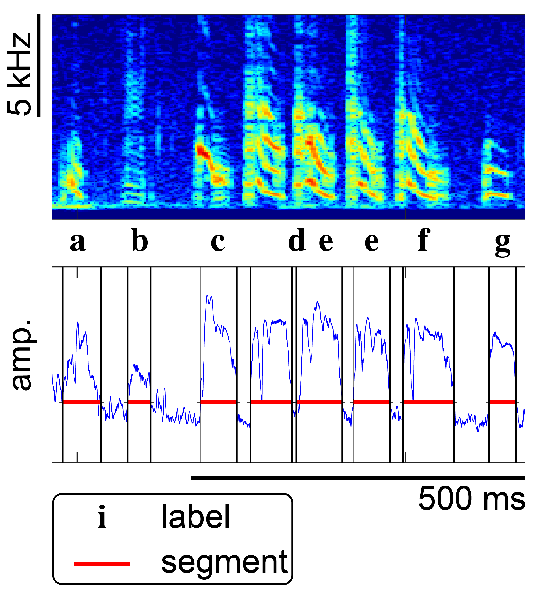

# notetate
## app for annotating animal vocalizations and other sounds

## about
goals:
- immediate:
  + open-source
  + works with multiple formats for annotating vocalizations (using https://github.com/NickleDave/crowsetta)
  + lightweight: think atom/sublime, not PyCharm/vscode
  + as configurable as possible: key bindings, color schemes for spectrograms
- longer term:
  + plug-in system
  + hackable -- Napari-like
  + web app

# background
prototype app developed for a workshop on GUIs for research software
https://imperialcollegelondon.github.io/GUIs-for-RS/
